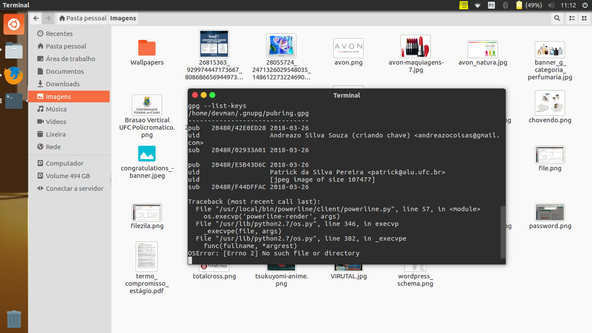

1-) criar, colocar foto e publicar sua chave no servidor remoto

 
2-)importar a chave de outra pessoa do servidor remoto.
Eu inportei a chave do Patrick e adicionei a minha lista
 

-3) enviar uma mensage assinada em texto plano.
Mensagem enviada foi: echo "Essa mensagem será encriptada" > MsgEncriptada
 
4-)enviar um arquivo .doc com assinatura em arquivo anexo
Os Arquivo de Mensagem criado e Criptografados estão em anexo a esse documento.
 
5-)assinar a chave do seu colega e reenviar ao servidor
 
6-)verificar a assinatura no servidor remoto

