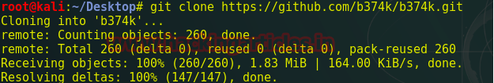
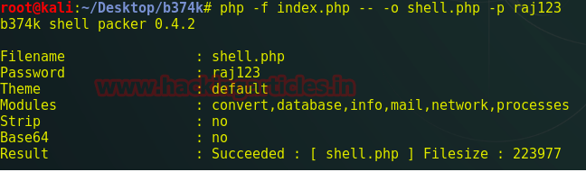
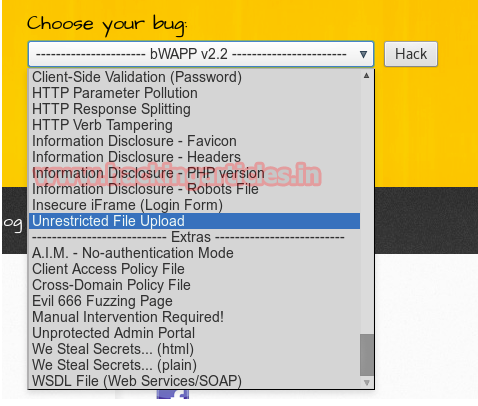
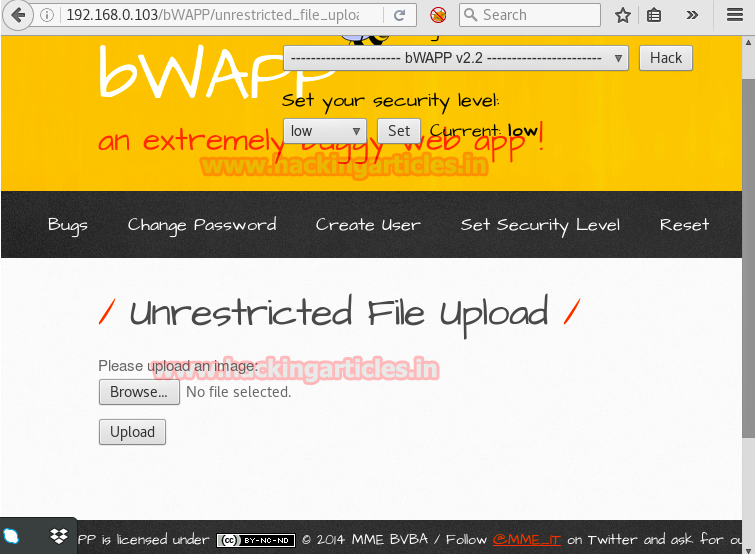
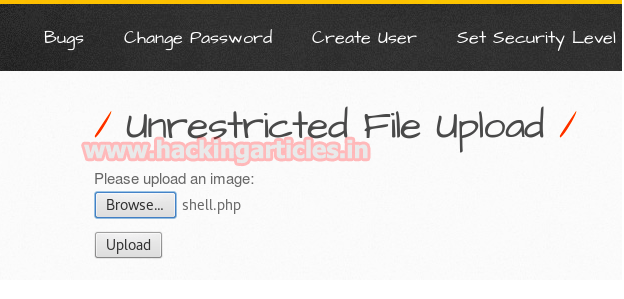
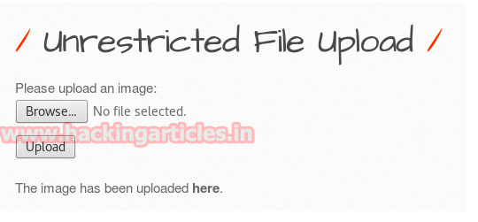
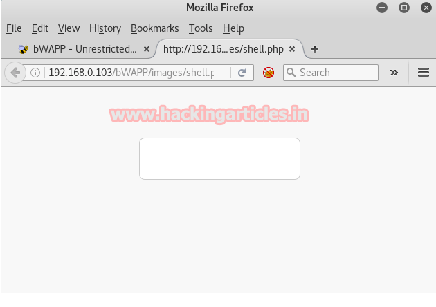
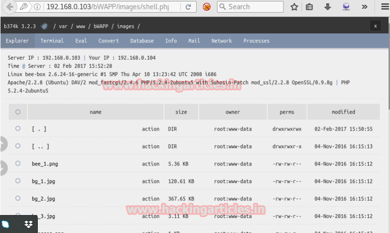

# Tutorial
### Link para os arquivos
---
### Aplicação contendo bugs
- [bWAPP](http://www.itsecgames.com/)
### WebShell backdoor
-  [WebShell](https://github.com/b374k/b374k)
### Instalação do PHP
- [PHP 7.1](https://sempreupdate.com.br/como-instalar-versoes-diferentes-do-php-5-6-7-0-e-7-1-no-ubuntu/)

## Remote File Inclusion
---

Através deste tutorial eu gostaria de compartilhar o upload de arquivo usando web shell em um servidor web e tentar obter acesso não autorizado no servidor.

Os shells da Web são os scripts que são codificados em diferentes linguagens como PHP, Python, ASP, Perl e muitos outros idiomas que ainda usam como backdoor para acesso não autorizado em qualquer servidor, enviando-o em um servidor web.

Assim que o shell for carregado no local de destino, o invasor poderá executar a operação de leitura e gravação diretamente, ele poderá editar qualquer arquivo ou excluir o arquivo do servidor.

##  B374k Shell
--- 
Abra o terminal e digite o seguinte comando para baixar o script b374k do github.
 
 `Git clone https://github.com/b374k/b374k`

 Este é um shell PHP que fornece reveres conexão com a máquina atacante e onde ele pode executar o comando para recuperar as informações da vítima.
 
 

 Seguinte comando irá criar um arquivo malicioso **shell.php** como o shell backdoor com **raj123** senha.

 `php -f index.php -- -o shell.php -p raj123` 
 
 

 Agora vamos abrir o IP de destino no navegador: **localhost/bWAPP/login.php**. Digite usuário e senha como **bee** e **bug** respectivamente.

 Definir o nível de segurança  baixo , na caixa de listagem escolhe seu erro selecione  Irrestrito File Upload agora e clique no hack.

  

  Aqui você pode ver o servidor web nos permite carregar uma imagem sob a página web de upload de arquivos sem restrições.

 

 Clique em **Browse** para carregar o **shell.php** no servidor web e, em seguida, clique em **Upload**.

 
 Agora você pode ler a mensagem da imagem que`“the image has been uploaded”` o que significa que a nossa backdoor PHP é carregado com sucesso. Agora clique no link `"here“`.

  

Aqui requeria senha para executar **shell.php** e eu tinha dado **raj123** como sua senha.

Você pode ver, estamos dentro do diretório de imagens.

Clique no **terminal** de guia de barra de menus de **b374k** que irá fornecer terminal de vítimas para executar os comandos desejados.

## Prática
- Mostre que você consegui realiar esse tutorial, refaça-o e mostro o print da tela.
- Execute 3 comandos no WebShell e tire print de cada um. 

